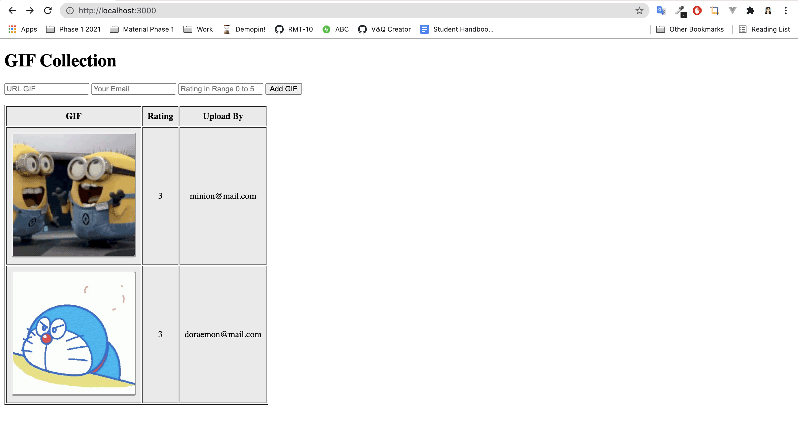

# GIF Collection

## Topic 
- [x] Sequelize Validation 
- [x] Helper 


<details> 
<summary>
 🎥 🎞 🎬 📽 📸
</summary>
Recap

```txt
Sequelize Validation : 
- Built-in 
- Custom

* custom message => {} dengan key msg
notEmpty : { msg : "Pesan kamu...." }

Helper 
Kamu punya function lepasan yang di require saat di butuhkan 
bisa di ejs (lewat controller kirimnya),  controller, model.
```
</details>

---

## Validation
Validation adalah sebuah proses pengujian/pengecekan yang bertujuan kepada data yang masuk sesuai format yang dibutuhkan.
- Client Side Validation (HTML)
- Server Side Validation (Server)

Kedua hal di atas merupakan validasi level aplikasi.  
> melakukan manipulasi ke database melalui GUI/PSQL bukan bagian dari aplikasi.


## Sequelize Validation 

```txt
Mungkin kalian ingat W2 handle validasi pada controller / model mengusahakan tidak menjalankan pool.query.
Sementara pada "sequelize" sudah disediakan Sequelize Validation
```

Sebuah cara validasi yang sediakan sequelize yang penggunaannya per-property pada model `(Per-attribute validations)`. 
Sequelize Valiation : 
- Built-in validators
- Custom validators

Error name from sequelize validation `"SequelizeValidationError"`


## DEMO : GIF Collection

```txt
Table "Posts" dengan column 
- UrlGIF (string) : berupa url 
- uploadBy (string) : berupa email
- rating (integer) : berupa angka 
```



1. Buat validasi bahwa seluruh property tidak boleh kosong.  
    - urlGIF merupakan string berformat Url
    > `UrlGIF` url-nya berupa gif (bukan png atau lainnya)
    - uploadBy merupakan string berformat Email
    - rating memiliki range angka 1 s/d 5

2. Buatlah message yang jelas! 
`gunakan res.send, terlebih dahulu.`


#### Final Expectation


## Helper

Helper atau yang kita maksud adalah helper function/class tergantung cara pembuatan kamu dalam bentuk apa.

> Merupakan proses code yang menerima input dan memberikan sebuah output (seperti function pada umumnya),  
> File terletak pada folder `helpers` karena diperuntukan untuk beberapa hal (fleksible) berprinsip _DRY_.


Untuk menghasilkan Expectation diatas maka : 
- Buat helper yang menghasilkan string berupa symbol bintang.
- Buat helper yang mengubah Date menjadi string berformat `DD/MM/YYYY HH:MM WIB`

new Date()

- getDate
- getMonth
- getFullYear
- getHours
- getMinutes

